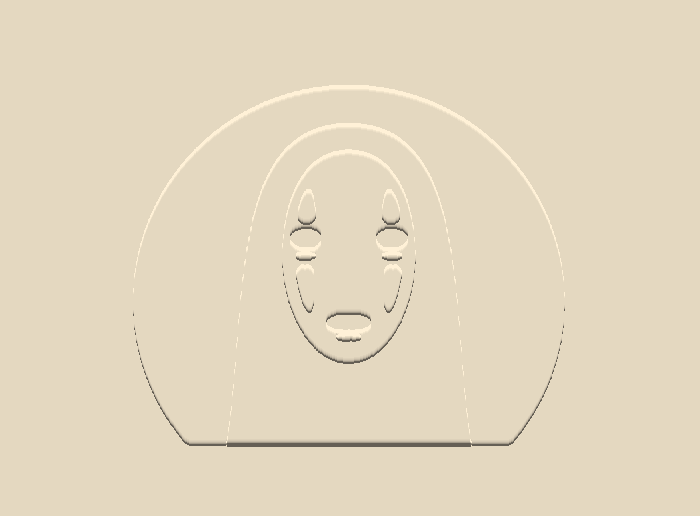
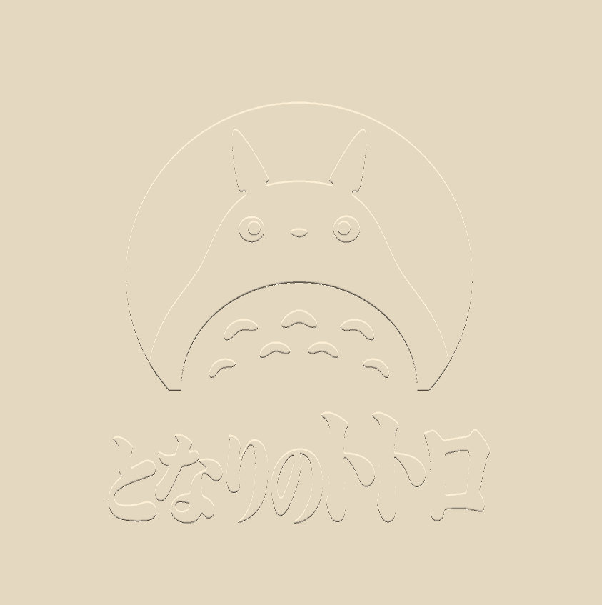

# Virtual Emobssing

This software uses a raster image of a layered vector drawing to simulate what it would look like if those layers were cut out and used to emboss a piece of paper. This is a pretty niche concept, so the code is very specific to one application: my friend creates paper crafts so I made it to help speed up his design process. You can read my blog about this project [here](http://zackpi.com/hobby/2019-06-03-emboss.html).

## How to use

Create a vector drawing of your choosing that looks like this, and clearly choose the colors of the layers based on the saturation channel to indicate the depth of the embossing:

Then take a raster image of it, using some desktop screenshot software (the easiest method in my opinion) or export the region of the design window to a .png or .jpg in your vector software. Running the code is easy; just save your image in this directory with the python script and open the command line and type this:

'''
python emboss.py [image]
'''

About a second later (depending on the size of the image you chose) the output image should pop up. You can either hit <Enter> or <Esc> to close the window, or <S> to save the image as `output.png' in the same directory. Here is some sample output for the image above:

## More sample output

#### Virtual embossings

#### Actual embossings

